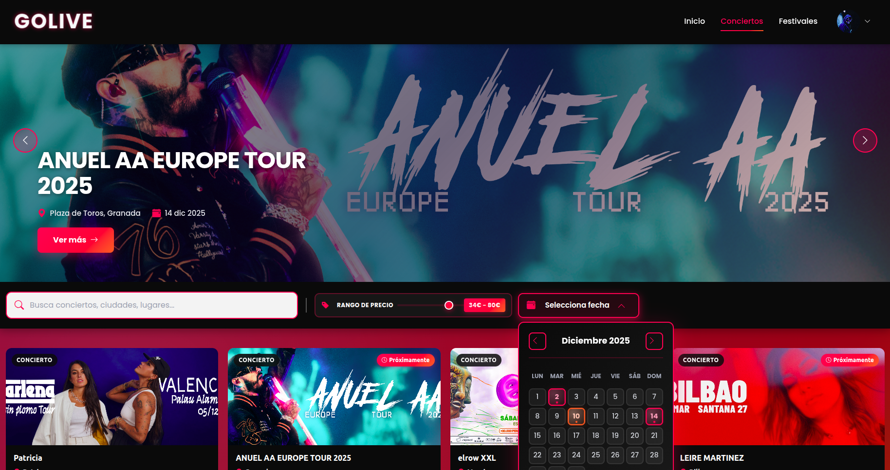
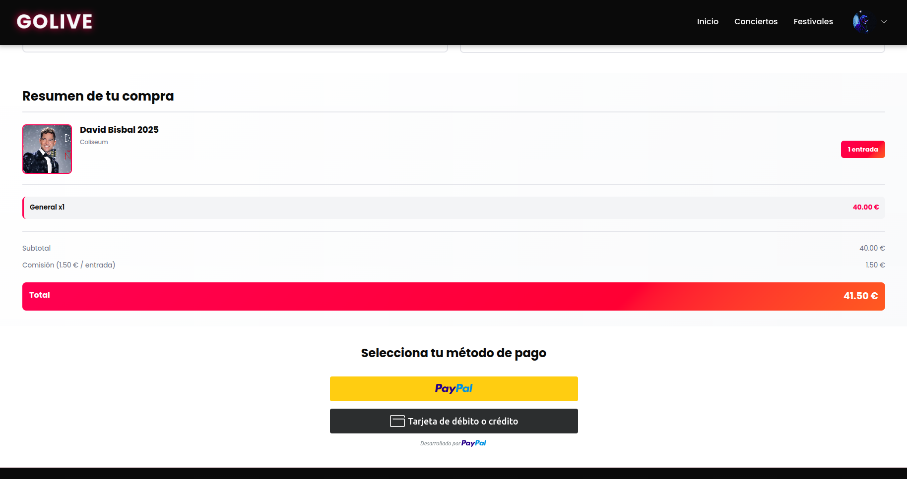
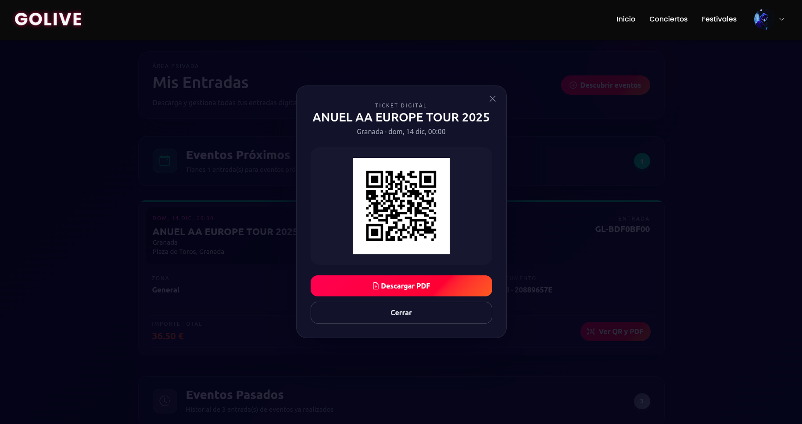
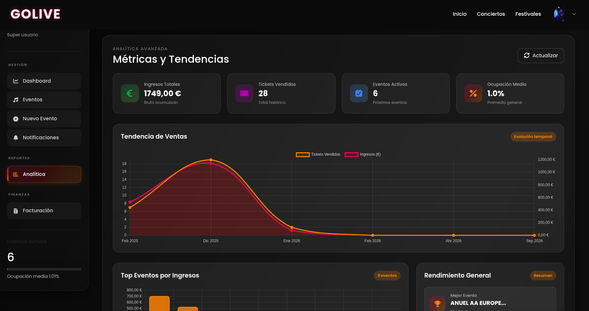

# 🎵 GoLive - Plataforma de Venta de Entradas para Eventos

[](https://www.oracle.com/java/)
[](https://spring.io/projects/spring-boot)
[](https://nodejs.org/)
[](https://nuxt.com/)
[](LICENSE)
[](https://www.mongodb.com/cloud/atlas)

Un proyecto Full Stack profesional que nace de la necesidad de crear una solución completa y escalable para la gestión y venta de entradas para eventos musicales (conciertos y festivales).

## 📋 TL;DR - Características Destacadas

- 🎫 **PWA instalable** con notificaciones push nativas
- 💳 **Pagos reales** integrados con PayPal
- 🎟️ **Tickets con QR y PDF** generados automáticamente
- 📊 **Dashboard admin** con métricas en tiempo real y gráficos
- 🌍 **Multiidioma** (Español, Inglés, Portugués)
- 🔔 **Notificaciones push** para recordatorios de eventos
- 🔐 **Autenticación JWT** con refresh tokens y RBAC
- 🗺️ **Mapas interactivos** para ubicación de eventos

## 🎯 ¿Qué hace el proyecto?

GoLive es una plataforma integral que permite a los organizadores de eventos gestionar, promocionar y vender entradas de forma eficiente, mientras ofrece a los usuarios una experiencia de compra fluida y segura. El sistema incluye:

- **Venta de entradas online** con múltiples zonas de precios
- **Panel de administración completo** con analytics en tiempo real
- **Sistema de pagos integrado** con PayPal
- **Generación automática de tickets** con códigos QR
- **Notificaciones push** para recordatorios de eventos
- **Chat asistente inteligente** para atención al cliente
- **Aplicación PWA** instalable en dispositivos móviles
- **Multiidioma** (Español, Inglés, Portugués)

## 🖼️ Demo / Screenshots

### Página Principal


### Catálogo de Conciertos


### Proceso de Compra de Entradas


### Tickets con Códigos QR


### Panel de Administración (Dashboard)


---

**Demo en vivo:** [https://golive-hu5d.onrender.com](https://golive-hu5d.onrender.com)

## 🏗️ Arquitectura

### Diagrama de Componentes

```
┌─────────────────────────────────────────────────────────────┐
│                        CLIENTE (Browser)                      │
│  ┌──────────────────────────────────────────────────────┐   │
│  │  Frontend (Nuxt.js 3 + Vue 3)                        │   │
│  │  - PWA instalable                                     │   │
│  │  - SSR/SSG                                            │   │
│  │  - Pinia (State Management)                          │   │
│  │  - Vue I18n (Multiidioma)                            │   │
│  └──────────────────────────────────────────────────────┘   │
└─────────────────────────────────────────────────────────────┘
                            │
                            │ HTTP/REST API
                            │
┌───────────────────────────▼──────────────────────────────────┐
│                    Backend (Spring Boot 3.2.7)               │
│  ┌──────────────────────────────────────────────────────┐   │
│  │  Controllers (REST API)                               │   │
│  │  - AuthController                                     │   │
│  │  - EventController                                    │   │
│  │  - TransactionController                             │   │
│  │  - UserController                                     │   │
│  └──────────────────────────────────────────────────────┘   │
│  ┌──────────────────────────────────────────────────────┐   │
│  │  Services (Lógica de Negocio)                        │   │
│  │  - AuthenticationService                             │   │
│  │  - EventService                                       │   │
│  │  - PaymentService                                     │   │
│  │  - EmailService                                       │   │
│  │  - PushNotificationService                           │   │
│  └──────────────────────────────────────────────────────┘   │
│  ┌──────────────────────────────────────────────────────┐   │
│  │  Security (Spring Security + JWT)                    │   │
│  │  - JWT Authentication                                 │   │
│  │  - RBAC (Role-Based Access Control)                  │   │
│  │  - BCrypt Password Encryption                        │   │
│  └──────────────────────────────────────────────────────┘   │
└─────────────────────────────────────────────────────────────┘
                            │
                            │ Spring Data MongoDB
                            │
┌───────────────────────────▼──────────────────────────────────┐
│              MongoDB Atlas (Base de Datos)                    │
│  - Users                                                     │
│  - Events                                                    │
│  - Transactions                                              │
│  - Tickets                                                   │
│  - Push Subscriptions                                        │
└─────────────────────────────────────────────────────────────┘

┌─────────────────────────────────────────────────────────────┐
│              APIs y Servicios Externos                       │
│  ┌──────────────┐  ┌──────────────┐  ┌──────────────┐      │
│  │  PayPal API  │  │ SendGrid API │  │ Web Push     │      │
│  │  (Pagos)    │  │  (Emails)    │  │ (VAPID)      │      │
│  └──────────────┘  └──────────────┘  └──────────────┘      │
└─────────────────────────────────────────────────────────────┘
```

### Stack Tecnológico

#### Frontend
| Tecnología | Versión | Propósito |
|------------|---------|-----------|
| **Nuxt.js** | 3.12.0 | Framework Vue.js con SSR y optimizaciones automáticas |
| **Vue 3** | 3.5.22 | Framework JavaScript reactivo |
| **Pinia** | 3.0.3 | Gestión de estado global |
| **Bootstrap 5** | 5.3.8 | Framework CSS para diseño responsivo |
| **Chart.js** | 4.5.1 | Gráficos y visualización de datos |
| **Leaflet** | 1.9.4 | Mapas interactivos |
| **Vue I18n** | 9.9.0 | Internacionalización multiidioma |
| **Axios** | 1.6.0 | Cliente HTTP para peticiones API |

#### Backend
| Tecnología | Versión | Propósito |
|------------|---------|-----------|
| **Spring Boot** | 3.2.7 | Framework Java para aplicaciones empresariales |
| **Java** | 17 | Lenguaje de programación |
| **Spring Security** | - | Autenticación y autorización |
| **Spring Data MongoDB** | - | Integración con base de datos |
| **JWT (jjwt)** | 0.11.5 | Autenticación stateless |
| **BCrypt** | - | Encriptación de contraseñas |
| **Lombok** | - | Reducción de código boilerplate |
| **Maven** | - | Gestión de dependencias |

#### Base de Datos
- **MongoDB** - Base de datos NoSQL
- **MongoDB Atlas** - Base de datos en la nube con alta disponibilidad

#### DevOps & Infraestructura
- **Docker** - Containerización
- **Docker Compose** - Orquestación de contenedores

#### Librerías y Utilidades
- **ZXing** (3.5.2) - Generación de códigos QR en backend
- **Apache PDFBox** (2.0.29) - Generación de PDFs
- **Web Push** (5.1.1) - Notificaciones push con protocolo VAPID
- **QRCode** (1.5.4) - Generación de códigos QR en frontend
- **html2canvas & jsPDF** - Exportación de contenido a PDF

## 🔐 Seguridad

GoLive implementa múltiples capas de seguridad siguiendo las mejores prácticas de la industria:

### Autenticación y Autorización
- **JWT (JSON Web Tokens)**: Autenticación stateless con tokens seguros
- **Refresh Tokens**: Renovación automática de tokens para mantener sesiones seguras
- **RBAC (Role-Based Access Control)**: Sistema de roles (user, admin, super_user) con Spring Security
- **Protección de rutas**: Middleware en frontend y guards en backend

### Encriptación y Protección de Datos
- **BCrypt**: Encriptación de contraseñas con hashing seguro (salt rounds)
- **HTTPS**: Comunicación segura en producción
- **Validación de datos**: Validación en frontend y backend con Spring Validation
- **Sanitización de inputs**: Prevención de XSS e inyección de código

### Protección de APIs
- **CORS configurado**: Orígenes permitidos específicos
- **CSRF Protection**: Configurado en Spring Security
- **Rate limiting**: (Recomendado para producción)
- **Validación de inventario**: Prevención de condiciones de carrera en compras

### Variables de Entorno
- **Secretos fuera del código**: Todas las claves sensibles se gestionan mediante variables de entorno
- **JWT Secret**: Clave secreta de al menos 32 caracteres para firmar tokens

## 🧪 Testing

El proyecto incluye tests básicos con JUnit 5 y Spring Boot Test:

### Ejecutar Tests

```bash
cd backend
mvn test
```

### Tests Disponibles

- **BackendApplicationTests**: Test básico de carga de contexto de Spring Boot

> **Nota:** Se recomienda expandir la suite de tests con:
> - Tests unitarios para servicios
> - Tests de integración para controladores
> - Tests de repositorios
> - Tests end-to-end para flujos críticos

## 📁 Estructura del Proyecto

```
GoLive/
├── frontend/                 # Aplicación Nuxt.js
│   ├── components/          # Componentes Vue reutilizables
│   │   ├── AdvancedSearch.vue
│   │   ├── ChatAssistant.vue
│   │   ├── EventCard.vue
│   │   ├── TicketCard.vue
│   │   └── Office/          # Componentes del panel admin
│   ├── pages/               # Páginas y rutas
│   │   ├── index.vue        # Página principal
│   │   ├── conciertos.vue
│   │   ├── festivales.vue
│   │   ├── backoffice.vue   # Panel admin
│   │   ├── oficina.vue      # Gestión de usuarios
│   │   ├── misEntradas.vue
│   │   └── pay/             # Proceso de pago
│   ├── composables/         # Lógica reutilizable (hooks)
│   │   ├── useAuth.js
│   │   ├── useEvents.js
│   │   ├── useTransactions.js
│   │   └── usePushNotifications.js
│   ├── stores/              # Estado global (Pinia)
│   │   └── cart.js
│   ├── plugins/             # Plugins de Nuxt
│   │   ├── axios.js
│   │   ├── i18n.js
│   │   └── pwa.client.js
│   ├── middleware/          # Middleware de autenticación
│   │   ├── auth.js
│   │   └── super-user-only.js
│   ├── locales/             # Archivos de traducción
│   │   ├── es.json
│   │   ├── en.json
│   │   └── pt.json
│   └── services/            # Servicios del frontend
│
├── backend/                 # Aplicación Spring Boot
│   ├── src/main/java/com/golive/backend/
│   │   ├── controller/      # Controladores REST
│   │   │   ├── AuthController.java
│   │   │   ├── EventController.java
│   │   │   ├── TransactionController.java
│   │   │   └── UserController.java
│   │   ├── services/        # Lógica de negocio
│   │   │   ├── AuthenticationService.java
│   │   │   ├── EventService.java
│   │   │   ├── PaymentService.java
│   │   │   └── EmailService.java
│   │   ├── repository/      # Acceso a datos (MongoDB)
│   │   ├── model/           # Entidades del dominio
│   │   ├── dto/             # Data Transfer Objects
│   │   ├── config/          # Configuración
│   │   │   ├── SecurityConfig.java
│   │   │   └── MailConfig.java
│   │   └── validation/      # Validadores personalizados
│   ├── src/main/resources/
│   │   └── application.properties
│   └── pom.xml
│
├── docker-compose.yml       # Configuración Docker
├── .gitignore
└── README.md
```

## ✨ Funcionalidades Principales

### Para Usuarios Finales
- 🔍 **Búsqueda avanzada** de eventos con autocompletado
- 🎫 **Compra de entradas** con selección de zonas y asistentes
- 💳 **Pago seguro** integrado con PayPal
- 📱 **Gestión de entradas** con códigos QR
- 🔔 **Notificaciones push** de recordatorios
- 💬 **Chat asistente** para consultas
- 🌍 **Multiidioma** (ES, EN, PT)
- 📱 **PWA instalable** en móviles

### Para Administradores
- 📊 **Dashboard analítico** con métricas en tiempo real
- 📈 **Gráficos de rendimiento** por categoría y evento
- 👥 **Gestión de usuarios** y roles (user, admin, super_user)
- 🎪 **CRUD completo de eventos** con zonas de precios
- 📧 **Sistema de notificaciones** masivas
- 💰 **Seguimiento de ingresos** y ocupación
- 📄 **Exportación de reportes**

### Características Técnicas
- 🔐 **Autenticación JWT** con refresh tokens
- 🛡️ **Autorización basada en roles** (RBAC)
- 🔄 **Validación de inventario** en tiempo real
- 📝 **Generación automática de tickets** con QR
- 📊 **Sistema de transacciones** completo
- 🗺️ **Integración de mapas** para ubicaciones
- 📱 **Diseño responsive** y mobile-first
- ⚡ **Optimizaciones de rendimiento** (lazy loading, caching)

## 🔌 APIs y Servicios Externos Integrados

### PayPal API
- **Integración completa** para procesamiento de pagos
- **SDK de PayPal** para botones de pago
- **Captura de pagos** y gestión de transacciones
- **Validación de órdenes** y manejo de webhooks

### SendGrid API
- **Envío de emails transaccionales** mediante API REST
- **Emails de recuperación de contraseña**
- **Confirmación de compra** con tickets adjuntos
- **Notificaciones de eventos** y recordatorios

### Web Push (VAPID)
- **Notificaciones push nativas** para PWA
- **Protocolo VAPID** para autenticación
- **Suscripciones de usuarios** para notificaciones

### MongoDB Atlas
- **Base de datos en la nube** con alta disponibilidad
- **Conexión segura** mediante URI con autenticación

## 📊 Estadísticas del Proyecto

- **+42 endpoints REST** implementados
- **+15 componentes Vue** reutilizables
- **+10 servicios** de negocio en backend
- **3 idiomas** soportados (ES, EN, PT)
- **Arquitectura** frontend/backend completamente separada
- **PWA** con notificaciones push nativas

## 💡 ¿Qué aprendí desarrollándolo?

### Arquitectura y Diseño
- ✅ Cómo estructurar un proyecto **Full Stack** desde cero con separación clara de responsabilidades
- ✅ Implementación de **arquitectura REST** escalable y mantenible
- ✅ Diseño de **APIs RESTful** con Spring Boot siguiendo mejores prácticas
- ✅ Gestión de **estado global** con Pinia en aplicaciones Vue complejas
- ✅ Implementación de **middleware** y **guards** para protección de rutas

### Integraciones y APIs
- ✅ Integración de **pasarelas de pago** (PayPal SDK) con manejo de webhooks
- ✅ Implementación de **servicios de email** transaccionales (SendGrid API)
- ✅ Configuración de **notificaciones push** con protocolo VAPID para PWA
- ✅ Conexión con **bases de datos en la nube** (MongoDB Atlas)
- ✅ Integración de **servicios de analytics** (Firebase)

### Seguridad
- ✅ Implementación de **autenticación JWT** stateless
- ✅ **Autorización basada en roles** (RBAC) con Spring Security
- ✅ **Encriptación de contraseñas** con BCrypt
- ✅ Validación y sanitización de datos de entrada
- ✅ Protección de endpoints sensibles

### Frontend Avanzado
- ✅ Desarrollo de **Progressive Web App (PWA)** instalable
- ✅ Implementación de **internacionalización (i18n)** multiidioma
- ✅ Creación de **componentes reutilizables** y composables
- ✅ Optimización de **rendimiento** con lazy loading y code splitting
- ✅ Diseño **responsive** y mobile-first
- ✅ Integración de **gráficos y visualizaciones** (Chart.js)

### Backend Empresarial
- ✅ Desarrollo con **Spring Boot** siguiendo arquitectura en capas
- ✅ Implementación de **servicios de negocio** complejos
- ✅ Gestión de **transacciones** y consistencia de datos
- ✅ Manejo de **excepciones** centralizado
- ✅ **Logging** estructurado para debugging y monitoreo

### DevOps
- ✅ **Containerización** con Docker
- ✅ Orquestación con **Docker Compose**
- ✅ Configuración de **entornos** (desarrollo, producción)
- ✅ Gestión de **variables de entorno** y secretos

### Funcionalidades Específicas
- ✅ Generación de **códigos QR** para tickets
- ✅ Creación de **PDFs** con información de tickets
- ✅ Sistema de **inventario en tiempo real** con validación
- ✅ Implementación de **chat asistente** con procesamiento de lenguaje natural básico
- ✅ Dashboard con **analytics** y métricas de negocio

## 🤝 Contribuciones

Este es un proyecto personal, pero cualquier sugerencia, mejora o feedback es bienvenido. Si encuentras algún bug o tienes una idea para mejorar la plataforma, no dudes en abrir un issue o crear un pull request.

## 📧 Contacto

**Gorka Carmona Pino**

- Email: gorkacarmonapino@email.com
- GitHub: [@Gorkacp](https://github.com/Gorkacp)
- LinkedIn: [gorka-carmona-pino-803902294](https://www.linkedin.com/in/gorka-carmona-pino-803902294/)

## 📝 Licencia

Este proyecto es de código abierto y está disponible bajo la [Licencia MIT](LICENSE).

---

⭐ Si te gusta este proyecto, ¡dale una estrella en GitHub!
